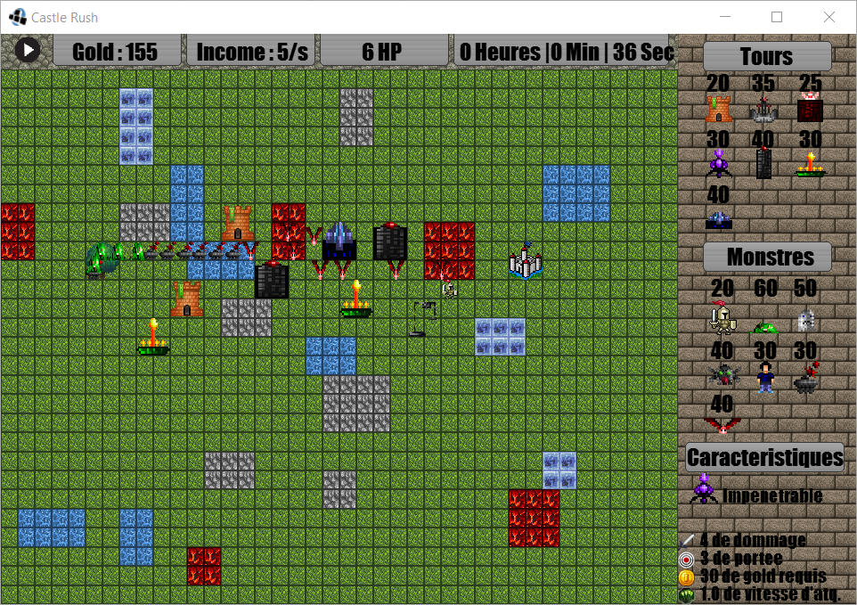

Castle Rush
======
*Not Your Typical Tower Defense*

Castle Rush is a tower defense game made in **Java** with the **LibGDX framework**.
The *medieval atmosphere* is reflected ingame by both the music and the sprites.
Two modes are available, the first is a *survival mode* and the second is a *multiplayer battle*.

Project description : [Website](https://johan-gras.github.io/projects/castlerush/)

